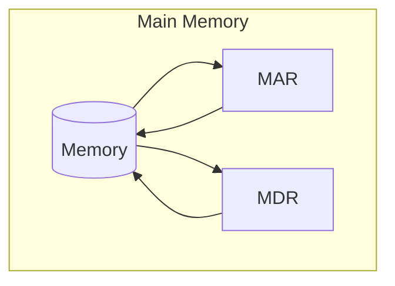
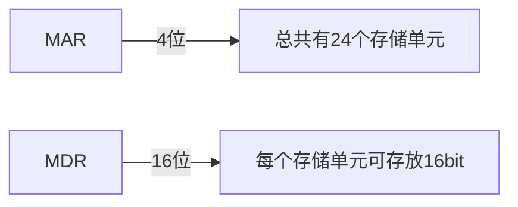

---
title:2022-12-17
uid: 202212170024
aliases: []
tags: []
from: 
---

[[MAR]]::Memory Address Register
[[MDR]]::Memory Data Register

---

[[MAR]] -> 存储单元的个数

[[MDR]] -> 存储字长

存储单元::每个存储单元存放一串二进制代码

存储字(word)::存储单元中二进制代码的组合

存储字长::存储单元中二进制代码的位数

存储元::即存储二进制的电子元件，每个存储元可存 1bit

---

